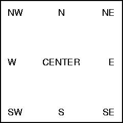
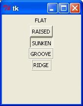
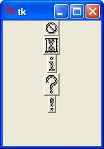

# Tkinter资源

Tkinter提供各种控件，如按钮，标签和文本框，在一个GUI应用程序中使用。这些控件通常被称为部件.
目前有15种Tkinter的部件:

|Operator		|Description|
|-|-|
|Button			|The Button widget is used to display buttons in your application.|
|Canvas			|The Canvas widget is used to draw shapes, such as lines, ovals, polygons, and rectangles, in your application.|
|Checkbutton		|The Checkbutton widget is used to display a number of options as checkboxes. The user can select multiple options at a time.|
|Entry			|The Entry widget is used to display a single-line text field for accepting values from a user.|
|Frame			|The Frame widget is used as a container widget to organize other widgets.|
|Label			|The Label widget is used to provide a single-line caption for other widgets. It can also contain images.|
|Listbox			|The Listbox widget is used to provide a list of options to a user.|
|Menubutton		|The Menubutton widget is used to display menus in your application.|
|Menu			|The Menu widget is used to provide various commands to a user. These commands are contained inside Menubutton.|
|Message			|The Message widget is used to display multiline text fields for accepting values from a user.|
|Radiobutton		|The Radiobutton widget is used to display a number of options as radio buttons. The user can select only one option at a time.|
|Scale			|The Scale widget is used to provide a slider widget.|
|Scrollbar		|The Scrollbar widget is used to add scrolling capability to various widgets, such as list boxes.|
|Text			|The Text widget is used to display text in multiple lines.|
|Toplevel		|The Toplevel widget is used to provide a separate window container.|
|Spinbox			|The Spinbox widget is a variant of the standard Tkinter Entry widget, which can be used to select from a fixed number of values.|
|PanedWindow		|A PanedWindow is a container widget that may contain any number of panes, arranged horizontally or vertically.|
|LabelFrame		|A labelframe is a simple container widget. Its primary purpose is to act as a spacer or container for complex window layouts.|
|tkMessageBox	|This module is used to display message boxes in your applications.|


## 各种组件的一些共有的属性
- Dimensions
	- 各种长度、宽度、部件的尺寸可以用许多不同的单位描述.
		- 如果您设置了尺寸为整数，它被假定为以像素为单位.
		- 您可以指定一个尺寸字符串，后跟一个数字单位.
	|Character	|Description|
    |-|-|
	|c			|Centimeters|
	|i			|Inches|
	|m			|Millimeters|
	|p			|Printer's points (about 1/72") |
	- 长度选项:
		- `borderwidth`: 边框的宽度，给人一种立体的外观感觉.
		- `highlightthickness`: 具有焦点的外部矩形的颜色.
		- `padX padY`: 立体空间，x和y方向.
		- `selectborderwidth`: 选择的时候外框宽度.
		- `wraplength`: Widget的执行自动换行的最大长度.
		- `height`: 所需部件的高度必须大于或等于1.
		- `underline`: 下划线，强调widget的文字（0是第一个，1是第二个参数等等）.
		- `width`: 所需的宽度的widget.

- Colors
	- Tkinter字符串的颜色。一般有两种方式来指定Tkinter的颜色:
		- 你可以使用一个字符串，指定红色，绿色和蓝色十六进制数字的比例。例如，“＃FFF”是白色的，“＃000000”是黑色的，“＃000fff000”是纯绿色，和“＃00FFFF”是纯青色（绿加蓝）.
		- 你还可以使用任何本地定义的标准颜色名称。颜色“白色”，“黑”，“红”，“绿色”，“蓝”，“青色”，“黄色”，“洋红”将始终可用.
	- 常见的颜色选项:
		- activebackground: 当widget是活跃widget的背景颜色.
		- activeforeground:小部件是活跃时的前景色.
		- background: widget的背景颜色。这也可以代表ASBG.
		- disabledforeground: 部件的前景色，当部件被禁用时.
		- foreground: widget的前景色。这也可以表示为FG.
		- highlightbackground: 部件具有焦点时的亮点区域的背景颜色.
		- highlightcolor: 前景色的亮点区域，部件具有焦点时.
		- selectbackground: widget的所选项目的背景颜色.
		- selectforeground: 前景色为widget的选定项目.

- Fonts
	- 最多可能有三种方式来指定类型风格.
		- 简单的tuple字体:
			- 作为一个tuple的第一个元素是字体家族，一个点的大小，可选择一个字符串，包含一个或更多的粗体，斜体，下划线的样式修饰符，加粗.
			- 例子:
			`("Helvetica", "16") for a 16-point Helvetica regular.`
			`("Times", "24", "bold italic") for a 24-point Times bold italic.`
		- 字体对象Fonts:
			- 你可以创建一个字体对象。由进口的tkFont的模块，并使用其字体类的构造:
				`import tkFont`
				`- font = tkFont.Font ( option, ... )`
			- 下面是选项列表:
				- family: 作为一个字符串的字体系列名称.
				- size: 作为一个整数，以点字体的高度。为了获得字体的n个像素高，使用-n.
				- weight: "bold" for boldface, "normal" for regular weight.
				- slant: "italic" for italic, "roman" for unslanted.
				- underline: 1 for underlined text, 0 for normal.
				- overstrike: 1 for overstruck text, 0 for normal.
			- 例子:
			`helv36 = tkFont.Font(family="Helvetica",size=36,weight="bold")`
		- X Window 字体:
			- 如果你正在运行X Window系统下，你可以使用任何的X字体名称.
				- 例如，名为“字体 - *-lucidatypewriter中的r-* - * - *-140 - * - * - * - * - * - *”是笔者最喜爱的固定宽度的屏幕上使用的字体。使用xfontsel计划，以帮助您选择美观的字体.

- Anchors
	- 锚是用来定义文本的相对位置参考点.
	这里是锚属性可以使用的常数列表.
    NW  N  NE  W  CENTER  E  SW  S  SE
	例如，如果使用中心作为一个文本锚文本将水平居中和垂直方向的参考点周围。
	锚重定位文本，以便参考点恰逢西北（左上）包含文本框的角落。
	W锚中心参考点周围的垂直文本，通过这一点的文本框的左边缘，依此类推.
    如果您创建了一个大的框架内的小部件和使用锚= se选项，部件将被放置在右下角的框架。如果您使用锚= n代替，部件将围绕沿顶边.
	

- Relief Styles
构件的浮雕式是指某些模拟的3-D周围的部件外的影响。下面是一排按钮的屏幕截图展示了所有可能的救济风格:
    - FLAT
    - RAISED
    - SUNKEN
    - GROOVE
    - RIDGE

```
from Tkinter import *
import Tkinter

top = Tkinter.Tk()

B1 = Tkinter.Button(top, text ="FLAT", relief=FLAT )
B2 = Tkinter.Button(top, text ="RAISED", relief=RAISED )
B3 = Tkinter.Button(top, text ="SUNKEN", relief=SUNKEN )
B4 = Tkinter.Button(top, text ="GROOVE", relief=GROOVE )
B5 = Tkinter.Button(top, text ="RIDGE", relief=RIDGE )

B1.pack()
B2.pack()
B3.pack()
B4.pack()
B5.pack()
top.mainloop()
```



- Bitmaps
你会使用这个属性显示一个位图。有以下类型的可用位图.:
	- "error"
	- "gray75"
	- "gray50"
	- "gray25"
	- "gray12"
	- "hourglass"
	- "info"
	- "questhead"
	- "question"
	- "warning"

```
from Tkinter import *
import Tkinter

top = Tkinter.Tk()

B1 = Tkinter.Button(top, text ="error", relief=RAISED,\
                         bitmap="error")
B2 = Tkinter.Button(top, text ="hourglass", relief=RAISED,\
                         bitmap="hourglass")
B3 = Tkinter.Button(top, text ="info", relief=RAISED,\
                         bitmap="info")
B4 = Tkinter.Button(top, text ="question", relief=RAISED,\
                         bitmap="question")
B5 = Tkinter.Button(top, text ="warning", relief=RAISED,\
                         bitmap="warning")
B1.pack()
B2.pack()
B3.pack()
B4.pack()
B5.pack()
top.mainloop()
```


- Cursors
Python的Tkinter的支持很多不同的鼠标光标的数字。确切的图形可能会有所不同，根据您的操作系统.
这里是大量有趣的的名单:
	- "arrow"
	- "circle"
	- "clock"
	- "cross"
	- "dotbox"
	- "exchange"
	- "fleur"
	- "heart"
	- "heart"
	- "man"
	- "mouse"
	- "pirate"
	- "plus"
	- "shuttle"
	- "sizing"
	- "spider"
	- "spraycan"
	- "star"
	- "target"
	- "tcross""trek"
	- "watch"

```
from Tkinter import *
import Tkinter
top = Tkinter.Tk()
B1 = Tkinter.Button(top, text ="circle", relief=RAISED,\
                         cursor="circle")
B2 = Tkinter.Button(top, text ="plus", relief=RAISED,\
                         cursor="plus")
B1.pack()
B2.pack()
top.mainloop()
``


